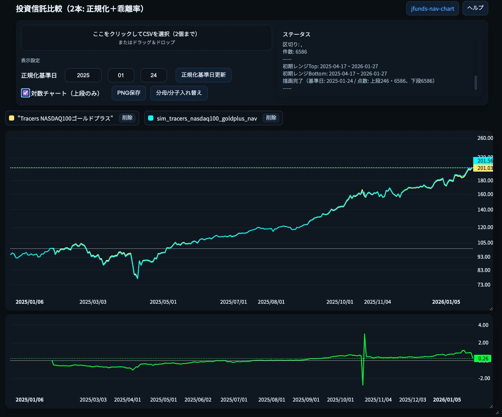
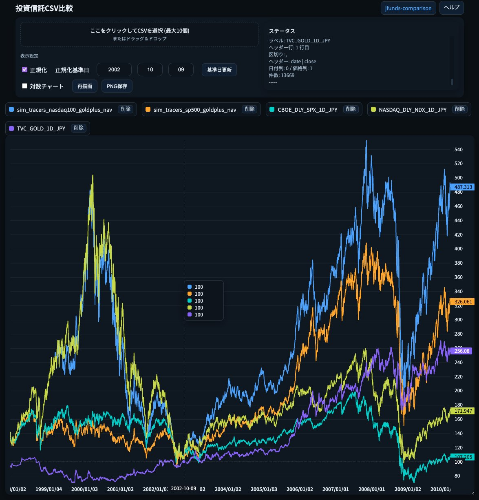
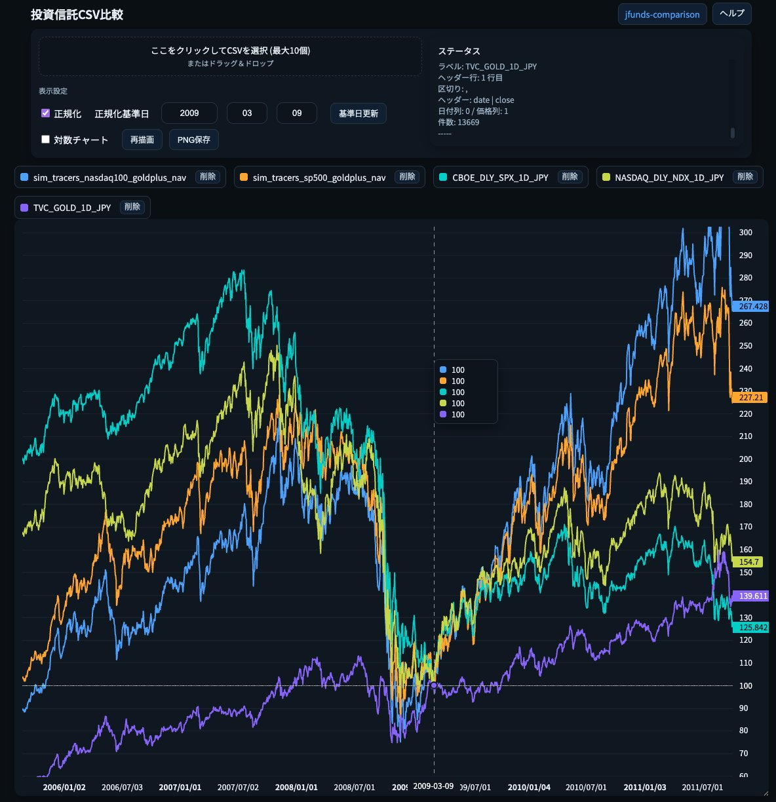
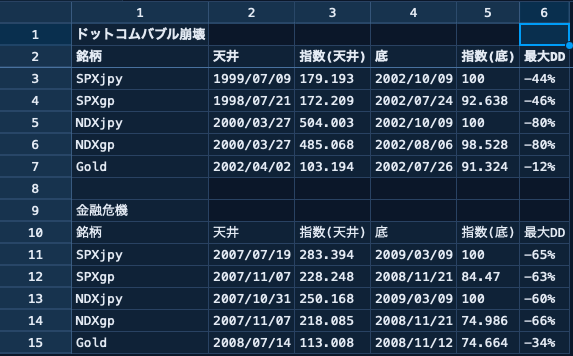

`vgp.py` は、投資信託 **Tracers [S&P500|NASDAQ100] ゴールドプラス** の基準価額を、日次でシミュレーションするスクリプトです。

# 前提

- `vgp.py`と`README.md`はほとんどCodexが書いたものです。暇つぶしなので内容や精度は一切保証しません。細かいことは無視してるので、上方にドリフトしてる気がします。
- YouTube等で似たようなことをしてるインフルエンサーがいるので、そちらをを見たほうがいいと思います。
- 改善点があれば教えてもらえるとうれしいです。
- データは提供元（TradingView、指数提供会社、銀行等）の利用規約に従いましょう。CSVファイルを他人に提供するのはダメだと思います。
- 気が向いたら、もうちょっと改善するかも

# シミュレーション結果

精度は一切保証しません！

ゴルナス実績との比較 -> https://hirotgr.github.io/jfunds-comparison/


ドットコムバブル崩壊での Max Drawdown -> https://hirotgr.github.io/jfunds-nav-chart/


金融危機での Max Drawdown -> 同上


まとめなど:

* ドットコムバブル/金融危機での最大DDは株単体とゴルプラ/ゴルナスであまり変わらないがリカバリーで差が付きそう
  * ただし、株とゴールドが両方とも年単位で大幅に下がり続ける状況が過去になかっただけで実質金利が上がったりドル高が継続すればゴルプラ戦略は破綻するかも
  * しかし、現在の各国の債務を考える金利高は許容できず、ポール・ボルカーの再来＋ゴールドの長期下落はないのでは？ -> そうならば、インフレを許容するしかない (知らんけど)




# ソース・データ

使用したデータは以下です。面倒なので dateの形式は YYYY-MM-DD だけの対応です。桁区切りのカンマにも対応していません。細かいことはコード参照。

- 株式（価格指数 + 配当込み指数(税引前)）
  - SPX, SPXTR: TradingViewからダウンロード
  - NDX: https://indexes.nasdaqomx.com/Index/History/NDX (Excelを日付降順にソートしてCSVにexport)
  - XNDX: https://indexes.nasdaqomx.com/Index/History/XNDX (同上)
- Bloomberg Gold Subindex（BCOMGC：Excess Return）: TradingViewからダウンロード
- 為替：三菱UFJ R&C の USD/JPY TTM（仲値）を CSVに加工したもの
  - 例: https://www.murc-kawasesouba.jp/fx/past_3month.php
- ゴールドプラス実績データ：ファンドの基準価額（CSV）
  - https://www.amova-am.com/fund/detail/645066
  - https://www.amova-am.com/fund/detail/645133

---

# モードの切り替え

`vgp.py` の `stock` 変数を変更すると S&P500 or NASDAQ100 を変更できます。

```python
stock = "SP500" # "SP500" (ゴルプラ) or "NASDAQ100" (ゴルナス) を指定する
```

# 生成されたCSVデータの参照

以下のツールで描画するといいのではと思います。 \
TradingView Lightweight Chartsで作ってます。普通の正規化チャートは左端の描画開始日を正規化しますが、任意の日付で正規化するので下落相場の大底で正規化するとドローダウンの様子が分かりやすいです(のはず..)

* https://hirotgr.github.io/jfunds-nav-chart/jfunds-nav-chart.html
* https://hirotgr.github.io/jfunds-comparison/jfunds-comparison.html


## ポイント

### 1) 株式は「疑似NTR: Net TR（配当税控除後）」で近似

S&P500の価格指数（PR）とトータルリターン指数（TR）から配当成分を抽出し、
配当税率（既定：10%）を掛けて、税引後に近い日次リターンを作ります。

例:
- `SPXTR`（TR）と `SPX`（PR）の差分 → 配当由来リターンとみなす
- 配当税率 `DIV_TAX_RATE` を適用して **疑似Net TR** を構成

### 2) 金は「BCOMGC（Excess Return）」を使用

BCOMGCは金先物のロール等を反映する（Excess Return）指数です。
本スクリプトでは金のドル建て日次リターンを `pct_change()` で計算します。

### 3) 基準価額は「日本の平日（TTMがある日）だけ」算出する

Tracersの基準価額（NAV）が公表されるのは日本の平日だけ、という前提に合わせて、
**出力（NAVを計算する日付）を MUFG TTM が存在する日付に限定**します。

具体的には、次のルールで「資産（米国市場日）」と「TTM（日本日付）」を整列します。

- 出力カレンダー：`MUFG_USD_TTM.csv` にレートが存在する日付（= 日本営業日を近似）
- 各日本営業日 `d` に対して、資産価格は「`d` より前の直近の米国市場日（`asset_date < d`）」の終値を使用
- その資産水準（株・金）を `d` のTTMで円評価してNAVを算出

この結合は `align_assets_to_fx_calendar()` で実装しています（`pd.merge_asof(..., direction='backward', allow_exact_matches=False)`）。

> これは “look-ahead（未来値混入）” を避けつつ、
> 「（日本が休みの間に進んだ）米国市場の値動き → 次の日本営業日のTTMで円評価」
> という想定を日付ベースで再現するための実装です。


### 4) 金の為替適用は3モード

金先物部分は差金決済であり、為替影響が株式と同じではない可能性があります。
そのため、金について為替をどう適用するかを選べるようにしています。

- `full`  : 金（元本も損益も）に為替をフル適用（通常の外貨資産換算）
- `none`  : 金USDリターンのみ（為替無視）
- `pnl_fx`: **差金決済の簡易近似**（金の損益＝リターン部分にだけ為替を掛ける）

既定は `pnl_fx` です。

---

## 入力ファイル

スクリプト先頭で以下のファイル名を参照しているので、環境に応じて変更してください。

- （S&P500モードの場合の例）
  - `SP_SPXTR_1D.csv` : S&P500 TR（配当込み）日次
  - `CBOE_DLY_SPX_1D.csv` : S&P500 PR（価格指数）日次
- （NASDAQ100モードの場合の例）
  - `NASDAQ_XNDX.csv` : NASDAQ-100 TR（XNDX）日次
  - `NASDAQ_NDX.csv` : NASDAQ-100 PR（NDX）日次
- `BBG_BCOMGC_1D.csv` : BCOMGC（Gold Excess Return）日次
- `MUFG_USD_TTM.csv` : USD/JPY TTM 日次
- `fund_info_645066_202601220907.csv` など: ファンド実績NAV
  - NASDAQ100（ゴルナス）の場合は `fund_info_645133_...csv`

> いずれもCSV列名揺れをある程度吸収するロジックが入っています。
> ただし、TradingViewエクスポート形式を想定しているため、列名が大きく異なる場合は調整が必要です。

---

## 使い方

```bash
python3 vgp.py
```

実行すると、デフォルトで以下のCSVが出力されます。

- `sim_tracers_[sp500|nasdaq100]_goldplus_nav.csv`
  - `nav`（シミュレーションNAV）
  - `r_eq_jpy`（株式円建て日次リターン）
  - `r_gold_jpy`（金円建て日次リターン）
  - `r_gross`（株+金 合成リターン）
  - `r_net`（経費控除後リターン）

---

## 評価（実績NAVとの突合）

`evaluate(sim, fund_nav)` は、シミュレーションNAVと実績NAVを同一日付で突合し、

- MAE（平均絶対誤差）
- RMSE（二乗平均平方根誤差）
- MAPE（平均絶対パーセント誤差）

を標準出力に表示します。

現在のコード例では、評価行と評価CSV出力はコメントアウトされています。

```python
# eval_df = evaluate(sim, fund_nav)

# out_eval = DATA_DIR / "sim_vs_fund_eval.csv"
# eval_df.to_csv(out_eval, index=True, encoding="utf-8-sig")
# print(f"Saved evaluation CSV: {out_eval}")
```

- **評価の表示だけ**したい：`eval_df = evaluate(...)` のコメントを外す
- **評価CSVも保存**したい：`out_eval...` の3行もコメント解除する

---

## 主要パラメータ（設定）

スクリプト冒頭の「設定」セクションで調整可能です。

- `BASE_NAV` : 基準価額の初期値（既定 10000）
- `DIV_TAX_RATE` : 配当課税率（既定 0.10 = 10%）
- `TER_ANNUAL` : 総経費率（年率、既定 0.0025 = 0.25%）
- `TRADING_DAYS` : 日次控除用の営業日数（既定 252）
- `GOLD_FX_MODE` : 金の為替適用モード（`full` / `none` / `pnl_fx`）

---

## 計算の概要（ざっくり式）

### 株（USD→JPY）

- 株USD日次リターン：疑似NTR(Net TR)
- 株JPY日次リターン：
  - `(1 + r_eq_usd) * (1 + r_fx) - 1`

### 金（USD→JPY）

- 金USD日次リターン：`BCOMGC.pct_change()`
- 金JPY日次リターン（既定 `pnl_fx`）：
  - `r_gold_usd * (1 + r_fx)`

### 合成（株100% + 金100%）

- `r_gross = r_eq_jpy + r_gold_jpy`

### 経費控除

- `ter_daily = TER_ANNUAL / TRADING_DAYS`
- `r_net = r_gross - ter_daily`

### NAV

- `NAV_t = NAV_{t-1} * (1 + r_net_t)`

---

## 補足


### A) 「為替適用タイミング」：なぜ資産日 t に翌営業日のTTMを使うのか

**問題になりやすい点**
米国市場の終値（S&P500やBCOMGC）は *米国時間の取引終了後* に確定します。一方、MUFGのTTMは通常 *日本時間の午前〜昼* に公表されるレートです。
このため、単純に「同じ日付」で資産価格とTTMを結合すると、時間順序が逆転することがあります（例：日本時間午前のTTMを、同日の米国終値の評価に使ってしまう）。

**本コードの前提（採用している近似）**

- 基準価額（NAV）を出力する日付は「日本の平日（= TTMが存在する日）」のみ
- 各日本営業日 `d` に対し、資産価格は「`d` より前の直近の米国市場日（`asset_date < d`）」の終値を使う
- その資産水準を、日本営業日 `d` のTTMで円換算する

これを実装しているのが `align_assets_to_fx_calendar()` で、`merge_asof(..., direction='backward', allow_exact_matches=False)` により
**`asset_date < fx_date` を満たす直近の終値**を結合します。


**例**

- 2024-01-10（米国市場日）の終値が確定（日本時間だと 2024-01-11 早朝）
- 2024-01-11（日本営業日）午前にTTMが公表
- よって「直近の米国終値（2024-01-10）」を「日本営業日（2024-01-11）のTTM」で円換算し、その日付でNAVを出力する

このような想定を、日付ベースで実現しています。

> 注意：実際の投信の基準価額算定レートは受託銀行等の規程に従うため、
> この前提が“必ず”一致する保証はありません。
> ただし、**look-ahead（未来値混入）**を避けるという意味で、この設計は保守的です。

---

### B) `GOLD_FX_MODE="pnl_fx"` の意味：なぜ金だけ為替の掛け方が違うのか

**背景**
株式部分は（近似的に）外貨資産をそのまま保有する形なので、円換算では
「USD建ての値動き × 為替（USD/JPY）の値動き」
がフルに効きます。

一方、金部分は「先物・差金決済」を利用しているため、
“元本そのものをドル資産として常時保有している” とみなすのは過大評価になり得ます。
差金決済では、評価損益（P/L）の受け払いが発生する一方、建玉の名目元本は現物保有とは異なる性質を持ちます。

**`pnl_fx` の近似ロジック**
- 金USDリターンが **0%** の日 → 金部分は為替だけでは動かない（円安だけで増えない）
- 金USDリターンが **+x% / -x%** の日 → その損益部分に対して為替が効く

コードでは次で表現しています：

- `r_gold_jpy = r_gold_usd * (1 + r_fx)`

**直感的な例**

- 金USDが0%（値動きなし）、円安 +2% の日
  - `pnl_fx` では金部分の円建てリターンは 0% 近傍（為替単独では増えない）
  - `full` だと +2% になってしまい、「金元本もドル資産として増える」扱いになります

- 金USDが +1%、円安 +2% の日
  - `pnl_fx`: 約 +1% × 1.02 ≒ +1.02%（損益にだけ為替が乗る）
  - `full`  : (1.01×1.02 - 1) ≒ +3.02%（元本も損益も為替が乗る）

どちらが実態に近いかは、金部分を「どの程度ドル資産として持っているとみなすか」に依存します。
本コードでは“差金決済近似”として `pnl_fx` を既定にしています（比較用に `full` / `none` も用意）。

### C) 株式先物の為替影響

面倒なので考慮していません。ちょっと影響あるかも。

---

## 注意点（重要）

1. **完全再現モデルではありません**

   実ファンドの売買タイミング、先物のロール、証拠金・短期金利、リバランス頻度等は、
   開示情報が限定的であるため、本スクリプトは合理的な近似モデルです。

   基本的には日々の流入資金でのバランス調整や先物ロールオーバー時にリバランスを行っているのではと推測していますが、相場が急変すると`100:100`のバランスがそれなりに崩れるのではと思ます（知らんけど）。

2. **為替適用タイミングは仮定**

- 米国市場の直近終値（日本営業日より前の終値）を、日本営業日のTTMで評価する前提を採用しています。
- 実際の算定規則（約定・算定の締時刻等）と厳密一致する保証はありません。

1. **CSV形式が異なる場合は読み込み処理の調整が必要**

   `load_tradingview_csv()` / `load_mufg_ttm_csv()` は列名推定を行いますが、
   想定と違う形式だと例外が発生することがあります。

---

## トラブルシューティング

### `[WARN] duplicate datetime index detected ...`
同一日付がCSVに重複している場合に表示されます。最後の行を採用して重複を除去します。

### `date column not found`
CSV内の日付列名が想定と違う可能性があります。
`load_tradingview_csv()` の date列候補（`time/date/datetime`）を追加するなどの対処が必要です。

### FX/資産が結合できない（NaNが出る）

`align_assets_to_fx_calendar()` は「日本営業日 `d` に対して `d` より前の直近の米国市場日」を結合します。
そのため以下の場合にNaNが出て、後段の `dropna()` で行が落ちることがあります。

- 分析期間の先頭付近：`d` より前の資産データがまだ存在しない
- 為替TTM側に欠落がある（※TTM欠落は別途対応する想定なら、TTM側の整備が必要）
- 米国休場が長期に続いた等で、`tolerance`（既定例：7日）を超えてマッチできない

必要なら `tolerance` を緩めるか、欠落期間のデータ整備を行ってください。

